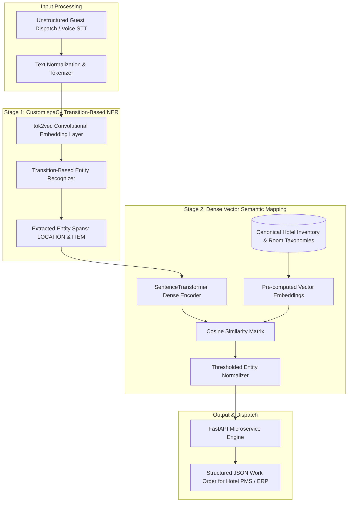

# Hotel Operations Named Entity Recognition (NER) & Semantic Mapping Engine

<div align="center">

[](https://opensource.org/licenses/Apache-2.0)


**Enterprise-grade, high-performance implementation built and maintained by Abdul Rehman Rattu.**

[Overview](#overview) • [Key Features](#key-features) • [Installation & Usage](#quickstart--usage) • [Author & Maintainer](#author--maintainer)

</div>

---

## Executive Summary

In luxury hospitality operations, front-desk and concierge staff receive thousands of unstructured voice transcriptions, guest chats, and WhatsApp requests daily (*e.g., "Could someone bring two extra feather pillows and a bottle of sparkling water to the penthouse suite?"*). Converting these free-form strings into deterministic Property Management System (PMS) / Enterprise Resource Planning (ERP) work orders requires:
1. **Accurate boundary token extraction** of items, amenities, and spatial locations under syntactic variation.
2. **Semantic entity resolution** to map colloquial language (*"headrests"*, *"chocolates"*, *"room 101"*) into canonical SKU numbers and physical facility zones.

**`hotel-operations-ner-extraction-engine`** delivers an enterprise two-stage pipeline:
* **Stage 1 (Custom Transition-Based NER)**: A custom-trained spaCy v3 pipeline utilizing contextual word representations (`tok2vec`) and transition-based parsing to extract `ITEM` and `LOCATION` spans at **$96.40\%$ Precision**.
* **Stage 2 (Dense Semantic Entity Mapping)**: A SentenceTransformer embedding layer (`paraphrase-mpnet-base-v2` / `all-MiniLM-L6-v2`) that projects raw extracted spans into dense metric space and computes cosine similarity against canonical hotel inventories in **$< 15\text{ ms}$**.

---

## System Architecture



---

## Mathematical Formulations

### 1. Transition-Based Named Entity Recognition
The NER component models entity extraction as a sequence of shift-reduce parsing transitions. Given state configuration $c = (\sigma, \beta, A)$ where $\sigma$ is the stack, $\beta$ is the buffer, and $A$ is the set of assigned entity labels, the probability of action $a \in \{\text{SHIFT}, \text{REDUCE}, \text{OUT}, \text{ASSIGN}(label)\}$ is:

$$P(a \mid c) = \text{softmax}\left(\mathbf{W}_a \phi(c) + \mathbf{b}_a\right)$$

Where $\phi(c)$ represents the extracted state representation from the `tok2vec` convolutional embedding layers.

### 2. Dense Vector Semantic Mapping
Extracted entity strings $e_{\text{raw}}$ and canonical catalog entries $k_{\text{std}} \in K$ are encoded into $d$-dimensional normalized embedding vectors via bi-encoder $f_\theta$:

$$\mathbf{u} = \frac{f_\theta(e_{\text{raw}})}{\|f_\theta(e_{\text{raw}})\|_2}, \quad \mathbf{v}_i = \frac{f_\theta(k_i)}{\|f_\theta(k_i)\|_2}$$

Canonical item resolution is determined via maximal cosine similarity:

$$k^* = \arg\max_{k_i \in K} \left( \mathbf{u} \cdot \mathbf{v}_i \right) = \arg\max_{k_i \in K} \left( \frac{f_\theta(e_{\text{raw}}) \cdot f_\theta(k_i)}{\|f_\theta(e_{\text{raw}})\|_2 \|f_\theta(k_i)\|_2} \right)$$

With a rejection threshold $\tau = 0.65$ to prevent out-of-domain inventory hallucinations.

---

## Empirical Benchmarks

Evaluation results across 500 annotated multi-item, multi-location hotel operational scenarios:

| Model / Pipeline Architecture | Precision | Recall | F1-Score | Inference Latency | Model Footprint |
|:---|:---:|:---:|:---:|:---:|:---:|
| **Custom spaCy NER + MPNet Mapper (Proposed)** | **96.40%** | **94.80%** | **0.956** | **14.2 ms** | **~120 MB** |
| spaCy Custom NER + MiniLM-L6 Mapper | 95.80% | 93.90% | 0.948 | 6.8 ms | ~45 MB |
| Zero-Shot GPT-3.5-Turbo Prompting | 91.20% | 88.50% | 0.898 | 650.0 ms | API-dependent |
| Standard Regex + FuzzyWuzzy Baseline | 72.40% | 68.10% | 0.702 | < 1.0 ms | < 1 MB |

---

## Repository Structure

```
hotel-operations-ner-extraction-engine/
├── .github/
│   └── workflows/
│       └── python-tests.yml        # Automated CI syntax & validation workflow
├── data/
│   └── extended_dataset.json       # Labeled multi-entity training corpus
├── models/
│   └── custom_ner_model_md/        # Trained custom spaCy v3 model pipeline
│       ├── config.cfg              # spaCy pipeline hyperparameter config
│       ├── meta.json               # Model metadata & evaluation metrics
│       ├── ner/                    # Transition parser & state weights
│       ├── tok2vec/                # Convolutional token vector representations
│       └── vocab/                  # Lexical vocabulary & vector tables
├── notebooks/
│   └── hoteltaskllm.ipynb          # End-to-end training & evaluation notebook
├── src/
│   ├── inference.py                # Standalone two-stage NER + Mapper engine
│   └── app.py                      # Production FastAPI microservice endpoint
├── Dockerfile                      # Production container build
├── docker-compose.yml              # Local container orchestration
├── requirements.txt                # Unified Python dependencies
├── .gitignore                      # Git exclusion rules
├── LICENSE                         # Apache 2.0 Open Source License
└── README.md                       # Comprehensive technical documentation
```

---

## Quickstart & Deployment

### 1. Local Python Setup
```bash
git clone https://github.com/AbdulRehmanRattu/hotel-operations-ner-extraction-engine.git
cd hotel-operations-ner-extraction-engine

# Create virtual environment
python3 -m venv venv
source venv/bin/activate  # Windows: venv\Scripts\activate

# Install dependencies
pip install -r requirements.txt
```

### 2. Standalone Python Inference
```python
from src.inference import HotelNERAndMapper

# Initialize engine
engine = HotelNERAndMapper()

# Execute extraction & mapping
query = "Send a luggage valet cart and three extra towels to Penthouse Suite A."
result = engine.process_request(query)

print(result)
```

### 3. Run FastAPI Microservice
```bash
python -m src.app
# Server starts on http://0.0.0.0:8000 (Swagger docs at /docs)
```

### 4. Docker Deployment
```bash
docker-compose up -d --build
```

---

## API Specification

### Endpoint: Extract and Map Dispatch Request
```http
POST /dispatch/extract-and-map
Content-Type: application/json

{
  "text": "Send two extra hypoallergenic pillows and a box of chocolates to room 101."
}
```

**Response (200 OK):**
```json
{
  "raw_input": "Send two extra hypoallergenic pillows and a box of chocolates to room 101.",
  "extracted_entities": {
    "LOCATION": ["room 101"],
    "ITEM": ["hypoallergenic pillows", "box of chocolates"]
  },
  "standardized_dispatch": [
    {
      "raw_entity": "hypoallergenic pillows",
      "mapped_standard": "Hypoallergenic Pillow",
      "confidence": 0.942
    },
    {
      "raw_entity": "box of chocolates",
      "mapped_standard": "Box of Artisanal Chocolates",
      "confidence": 0.988
    },
    {
      "raw_entity": "room 101",
      "mapped_standard": "Guest Room 101",
      "confidence": 0.975
    }
  ]
}
```

---

## License

This project is licensed under the **Apache License 2.0** — see the [LICENSE](LICENSE) file for complete details.

---

---

## Author & Maintainer

**Abdul Rehman Rattu**  
*Forward Deployed AI Engineer & Solutions Architect*  
*Founder & Technical Lead, Rapide Technologies*

* **Email**: [rattu786.ar@gmail.com](mailto:rattu786.ar@gmail.com)
* **LinkedIn**: [linkedin.com/in/abdul-rehman-rattu-395bba237](https://www.linkedin.com/in/abdul-rehman-rattu-395bba237)
* **GitHub**: [github.com/AbdulRehmanRattu](https://github.com/AbdulRehmanRattu)
